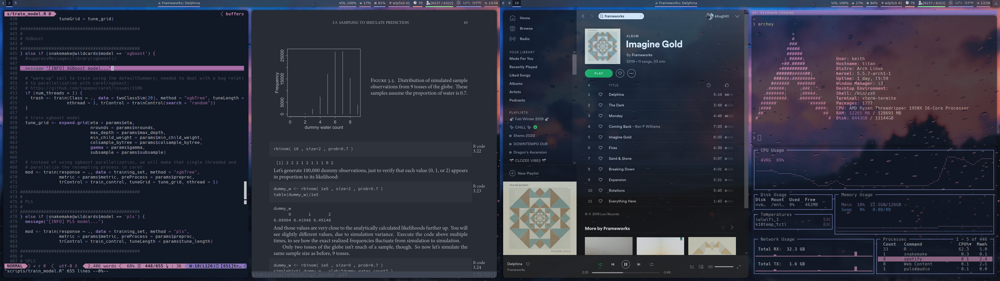

Keith's dotfiles
================

Current setup
-------------

* [Arch Linux](https://www.archlinux.org/)
* [i3](https://i3wm.org/)
* [picom](https://github.com/yshui/picom)
* [Zsh](http://www.zsh.org/)
* [kitty](https://sw.kovidgoyal.net/kitty/)
* [polybar](https://github.com/polybar/polybar)
* [rofi](https://github.com/davatorium/rofi)

Tools
-----

* [bat](https://github.com/sharkdp/bat)
* [dust](https://github.com/bootandy/dust)
* [fasd](https://github.com/clvv/fasd)
* [fd](https://github.com/sharkdp/fd)
* [feh](https://feh.finalrewind.org/)
* [fzf](https://github.com/junegunn/fzf)
* [gotop](https://github.com/xxxserxxx/gotop)
* [lsd](https://github.com/Peltoche/lsd)
* [micromamba](https://mamba.readthedocs.io/en/latest/user_guide/micromamba.html)
* [moar](https://github.com/walles/moar)
* [neovim](https://neovim.io/)
* [radian](https://github.com/randy3k/radian)
* [rg](https://github.com/BurntSushi/ripgrep)
* [tmux](https://github.com/tmux/tmux/wiki)
- [tre](https://github.com/dduan/tre)
* [visidata](https://www.visidata.org/)
* [zathura](https://pwmt.org/projects/zathura/)
* [zinit](https://github.com/zdharma/zinit)

Installation
------------

To install, simply clone this repo and run `setup.sh`:

    git clone https://github.com/khughitt/dotfiles
    cd dotfiles && ./setup.sh

Symbolic links will be created in `$HOME` / `$XDG_CONFIG_DIR` to all of the major
configuration files.

Configuration files are included for both Bash and Z shell. If you plan to use
Z shell, you will also want to install [zinit](https://github.com/zdharma/zinit).

Additional Z shell plugins I'm currently using:

 * [pure prompt](https://github.com/sindresorhus/pure)
 * [zsh-nvm](https://github.com/lukechilds/zsh-nvm.git)
 * [zsh-completions](https://github.com/zsh-users/zsh-completions)

..And a bunch others. 

Screenshot
----------

