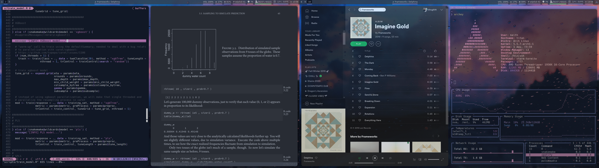

Keith's dotfiles
================

Current setup
-------------

* [Arch Linux](https://www.archlinux.org/)
* [Niri](https://niri-wm.github.io/)
* [Noctalia](https://github.com/noctalia-dev/noctalia-shell)
* [Zsh](http://www.zsh.org/)
* [kitty](https://sw.kovidgoyal.net/kitty/)

Tools
-----

* [bat](https://github.com/sharkdp/bat)
* [btop](https://github.com/aristocratos/btop)
* [dust](https://github.com/bootandy/dust)
* [fd](https://github.com/sharkdp/fd)
* [feh](https://feh.finalrewind.org/)
* [fzf](https://github.com/junegunn/fzf)
* [lsd](https://github.com/Peltoche/lsd)
* [micromamba](https://mamba.readthedocs.io/en/latest/user_guide/micromamba.html)
* [moor](https://github.com/walles/moor)
* [neovim](https://neovim.io/)
* [radian](https://github.com/randy3k/radian)
* [rg](https://github.com/BurntSushi/ripgrep)
* [sd](https://github.com/chmln/sd)
* [tmux](https://github.com/tmux/tmux/wiki)
* [tre](https://github.com/dduan/tre)
* [visidata](https://www.visidata.org/)
* [zathura](https://pwmt.org/projects/zathura/)
* [zinit](https://github.com/zdharma/zinit)
* [zoxide](https://github.com/ajeetdsouza/zoxide)

Installation
------------

To install, clone this repo and run `setup.sh`:

    git clone https://github.com/khughitt/dotfiles
    cd dotfiles && ./setup.sh

Symbolic links will be created in `$HOME` / `$XDG_CONFIG_DIR` to all of the major
configuration files.

For a safe preview of the headless link setup:

    just setup-dry-run

For a link-only setup that skips package installation and external clones:

    ./setup.sh --link-only --headless

`setup.sh` can also run selected phases. This is useful when refreshing a small
piece of the setup after a change:

    ./setup.sh --dry-run --link-only --headless --only shell,systemd
    just setup-only shell,systemd

Valid phases are:

    preflight external-clones shell gtk graphical-config common-config systemd kitty home app-config noctalia-plugins mime dropbox-ignore tmux packages

To install the systemd user timer that keeps high-flux Dropbox folders ignored:

    ./setup.sh --link-only --headless --only systemd --enable-user-timers

The timer runs `dropbox_ignore_flux` periodically. It sets Dropbox's
`com.dropbox.ignored` attribute on common high-churn directories such as
`node_modules`, `.venv`, `.worktrees`, `.snakemake`, and `__pycache__`.

A new machine
-------------

Three kinds of state live here, and only the first arrives with the clone.

1. **Tracked in git.** Everything `setup.sh` links.
2. **In the tree but not in git.** The checkout is inside Dropbox, so an
   untracked file still reaches every other machine. Generated per-machine
   output must therefore leave the tree: it lives under `XDG_STATE_HOME` and is
   linked back in, and `dotfiles-health` fails when one of those links is a real
   file instead. Anything that must sit in the tree and must not sync carries
   Dropbox's `com.dropbox.ignored` — `node_modules`, `.venv`, `.worktrees`, and
   niri-material's `.cargo` and `target`. Applications also write per-machine
   state straight into the tree through the whole-directory `~/.config` links
   (fcitx's caches and D-Bus address, crush's session database, familiar's
   installed theme art); those paths are declared in
   `lib/dotfiles-setup-data.bash`, the `dropbox-ignore` phase creates and marks
   them on each machine, and `dotfiles-health` fails when one is left unmarked.
3. **Per-machine: in neither git nor Dropbox.** These have to be reproduced by
   hand, and each one used to surface as an opaque crash in the middle of a
   setup run, one at a time.

Run `setup.sh --check` first. It names every unmet prerequisite of the third
kind at once, with its fix, and mutates nothing:

| What | Where | How to reproduce |
| --- | --- | --- |
| Prism's node dependencies | `~/d/prism/node_modules` | `npm ci --prefix ~/d/prism` |
| Familiar's node dependencies | `~/d/familiar/node_modules` | `npm install --prefix ~/d/familiar` |
| The niri-material build | the installed `niri` package | build `packaging/arch/PKGBUILD` in `~/d/niri-material` and install it |
| What each prism sink needs (quickshell, a niri that accepts the material node) | declared in the sink's `manifest.yaml`, evaluated by `prism requirements` | preflight relays each unmet line and its fix verbatim |
| Noctalia | the installed `noctalia-qs` package | install it from the AUR |
| The task tracker | the `tasks` binary and `~/.config/tasks/projects.toml` | install `tasks`, then `tasks init` in each project |
| Mindful's database password | `~/.config/mindful.env` | write `MINDFUL_DBPASS=…`, mode 600 |
| A fast build disk (optional) | `.cargo/config.toml` in `~/d/niri-material` | set `build.target-dir`, then `setfattr -n user.com.dropbox.ignored -v 1 .cargo` |

Two things worth knowing about the ~/.config surface. The entries that are
whole-directory symlinks into this tree — `niri`, `kitty`, `zathura`, and the
per-machine `prism` directory — hand every file an application writes there to
the shared tree; the ones that are real directories (`btop`, `yazi`, `bat`,
`lsd`, `gtk-3.0`, `fastfetch`) cannot. `dotfiles-health` warns about every path
under a linked one that the tree does not own. And Noctalia writes *through* a
symlink rather than replacing it, which is what lets its generated theme output
be a link out to per-machine state; `noctalia msg templates-apply` renders that
output, and `setup.sh` asks for it whenever it is still empty.

Configuration files are included for both Bash and Z shell. If you plan to use
Z shell, you will also want to install [zinit](https://github.com/zdharma/zinit).

Additional Z shell plugins I'm currently using:

 * [pure prompt](https://github.com/sindresorhus/pure)
 * [zsh-nvm](https://github.com/lukechilds/zsh-nvm.git)
 * [zsh-completions](https://github.com/zsh-users/zsh-completions)

..And a bunch others. 

Commands
--------

Common maintenance commands are wrapped in `just`:

```
just check          # run shell syntax, shellcheck, and modeline checks
just test           # run Python and Zsh/shell tests
just health         # check links and local setup without querying systemd state
just health-systemd # include systemd user timer state
just setup-dry-run  # preview headless link-only setup
just setup-only ... # preview selected setup phases, e.g. shell,systemd
just verify         # run check, test, and health
```

`bin/dotfiles-health` verifies required tools, important managed symlinks,
shell sourceability, Dropbox ignore timer links, and stale config links that
were intentionally removed from setup management.

Aliases / Functions
-------------------

Not a complete list, but some useful ones..

```
j       # jump (zoxide)
l       # ls -l
lr      # ls -latr
y       # yay

..      # cd ..
cpr     # cp -r
rmf     # rm -fr

c       # open cheatsheet
C       # open config

doc     # docker
docc    # docker compose
up      # bring up compose stack
down    # bring down compose stack

g       # git
gst     # git status
gcam    # git commit -am
gcmsg   # git commit -m
gco     # git checkout
gp      # git push
grst    # git restore --staged

h ..    # search history
pg ..   # search ps

rgl     # rg -l
rgu     # rg -uuu
fda     # fd -Luu

v       # nvim recent
vl      # nvim last
vr      # rg -> nvim
```

Screenshot
----------


