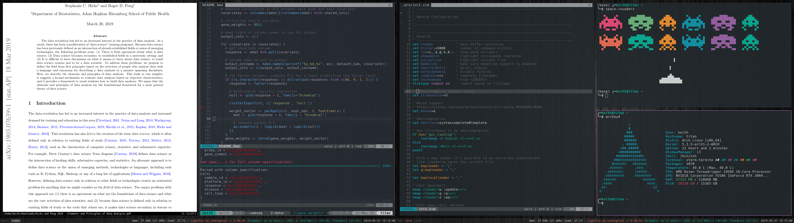

Keith's dotfiles
================

Installation
------------

To install, simply clone this repo and run `setup.sh`:

    git clone https://github.com/khughitt/dotfiles
    git submodule update --init --recursive
    cd dotfiles && ./setup.sh

Symbolic links will be created in $HOME to all of the major configuration files.

Configuration files are included for both Bash and Z shell. If you plan to use
Z shell you will also want to install [oh-my-zsh](https://github.com/robbyrussell/oh-my-zsh).

Additional Z shell plugins I'm currently using:

 * [biozsh](https://github.com/kloetzl/biozsh.git)
 * [git-auto-status](https://gist.github.com/oshybystyi/475ee7768efc03727f21)
 * [zsh-nvm](https://github.com/lukechilds/zsh-nvm.git)
 * [zsh-syntax-highlighting](https://github.com/zsh-users/zsh-syntax-highlighting)
 * [zsh-completions](https://github.com/zsh-users/zsh-completions)
 
Both of these are available on Github, and for [Arch Linux](https://www.archlinux.org/)
users, the plugins are also available on the [Arch User Repository (AUR)](https://aur.archlinux.org/).

Screenshot
----------

Current setup:

 * [Arch Linux](https://www.archlinux.org/)
 * [i3](https://i3wm.org/)
 * [Z shell](http://www.zsh.org/)

